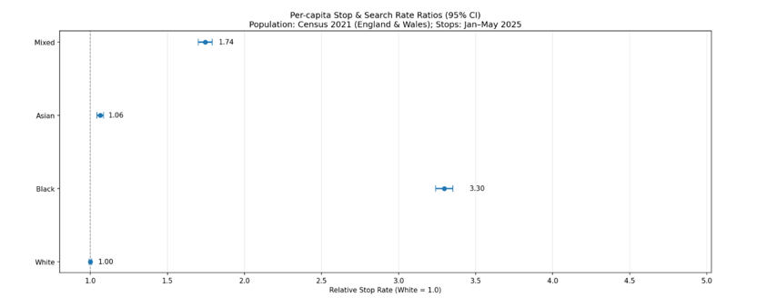
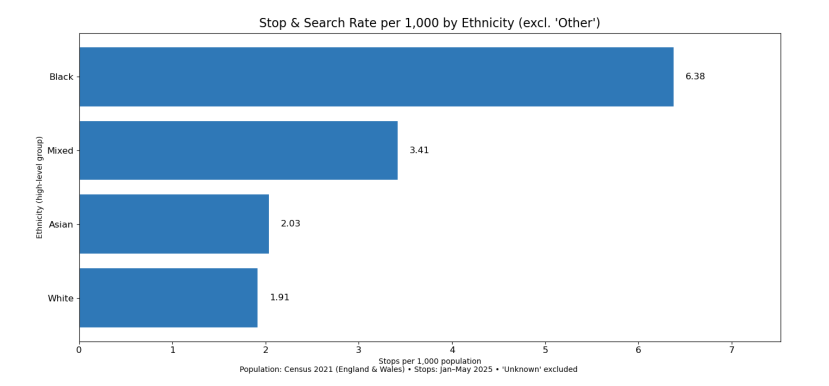
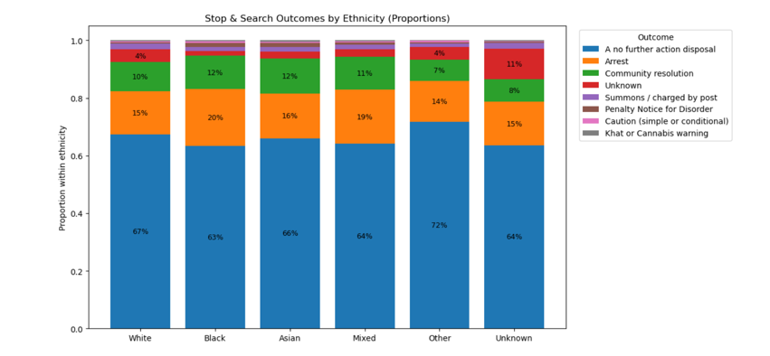
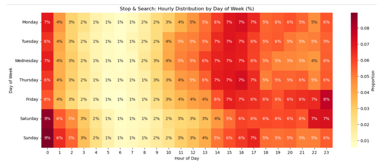
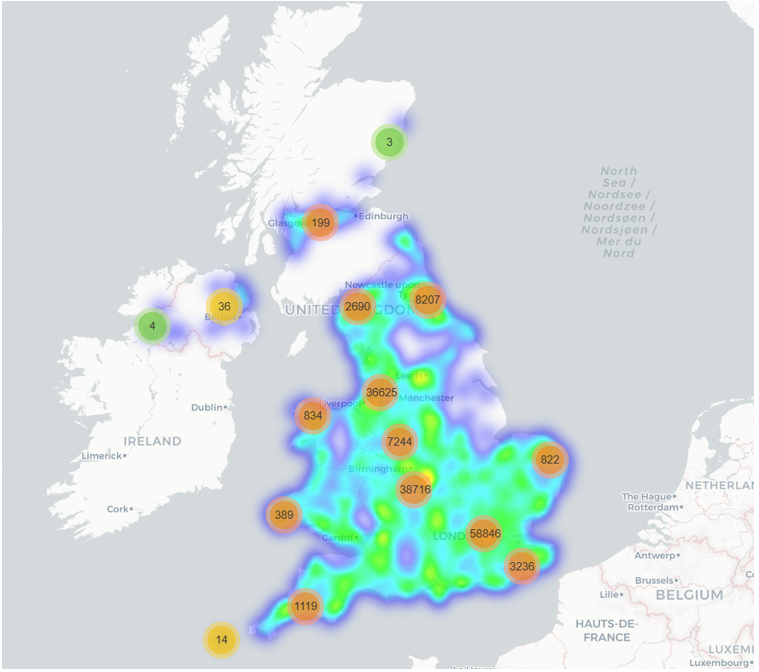
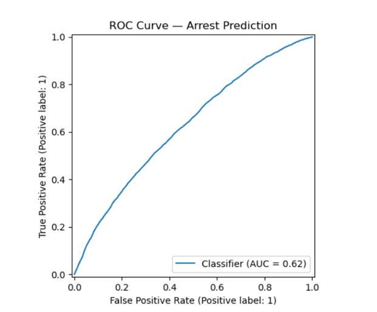

# Police Stop-and-Search Data Analysis

Tools: Python, pandas, numpy, matplotlib, seaborn, folium, scikit-learn, statistical analysis, machine learning, geospatial analysis

This project analyses police stop-and-search data from England and Wales using exploratory data analysis, statistical testing, geographic visualisation, and predictive modelling.

The analysis investigates ethnic disproportionality in stop-and-search activity, temporal crime patterns, geographic hotspots, policing outcomes, and predictive modelling performance using real-world police datasets.

The project was developed in Python using large-scale police datasets sourced from data.police.uk.

---

## Project Overview

The analysis focused on:

- Stop-and-search activity across ethnic groups
- Relative stop rates and disproportionality
- Geographic concentration of police searches
- Hourly and weekday policing patterns
- Search outcome distributions
- Predictive modelling using logistic regression

The project combines data cleaning, feature engineering, exploratory data analysis, mapping, statistical interpretation, and machine learning.

---

## Key Findings

- Significant disproportionality was identified across ethnic groups in stop-and-search rates.
- Geographic hotspot analysis revealed strong clustering of searches in urban areas.
- Temporal analysis showed identifiable hourly and weekday policing patterns.
- Outcome distributions varied across ethnic groups.
- Logistic regression modelling demonstrated limited but measurable predictive capability.
- The project highlighted challenges associated with bias, class imbalance, and real-world policing datasets.

---

## Visualisations

### Ethnicity Rate Ratios



This visual compares stop-and-search rate ratios across ethnic groups to examine disproportionality within policing activity.

---

### Relative Stop Rates



Relative stop rates were analysed to compare stop frequencies across population groups.

---

### Outcomes by Ethnicity



This visual explores how stop-and-search outcomes vary across ethnic groups.

---

### Hourly and Weekday Heatmap



Temporal analysis identified patterns in policing activity across hours of the day and days of the week.

---

### Geographic Heatmap



Geospatial analysis was conducted using latitude and longitude data to identify search hotspots.

---

### Logistic Regression ROC Curve



A logistic regression classifier was evaluated using ROC analysis to assess predictive performance.

---

## Machine Learning and Statistical Methods

The project included:

- Logistic Regression
- Classification evaluation metrics
- ROC curve analysis
- Feature engineering
- Missing value handling
- Geospatial visualisation
- Aggregation and grouping analysis
- Temporal analysis
- Exploratory data analysis

---

## Project Structure

```text
Police-Stop-and-Search-Data-Analysis/

├── Police_Data.ipynb
├── Crime, Disproportionality, and Policing An Analysis of Stop and Search.docx
├── ethnicity_rate_ratios.png
├── geographic_heatmap.png
├── hourly_weekday_heatmap.png
├── logistic_regression_roc.png
├── outcomes_by_ethnicity.png
├── relative_stop_rates.png
└── README.md
```
## Author

**Sarunas Surdokas**  
